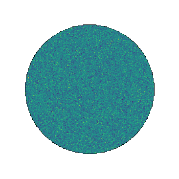

# ST+VAE for HI Phase Decomposition 

Data-driven, morphology-based component separation model using scattering transform and Gaussian-mixture VAEs, applied to the problem of neutral hydrogen phase decomposition. 

For a quick start, see `tutorials`. 

<div style="display: flex; justify-content: space-between;">
    
    
    
</div> 

## Dependencies
```bash
pip install -r requirements.txt
```
**Additional dependencies:**

`scattering`: https://github.com/minjielei/scattering_transform

## Datasets
The HI phase statistical priors and maps are publicly available on [dataverse](https://dataverse.harvard.edu/dataset.xhtml?persistentId=doi%3A10.7910%2FDVN%2FEXJLF3&version=1.0).

## Citation
Lei et al., 2025 - [https://arxiv.org/abs/2505.20407](https://ui.adsabs.harvard.edu/abs/2025arXiv250520407L/abstract)